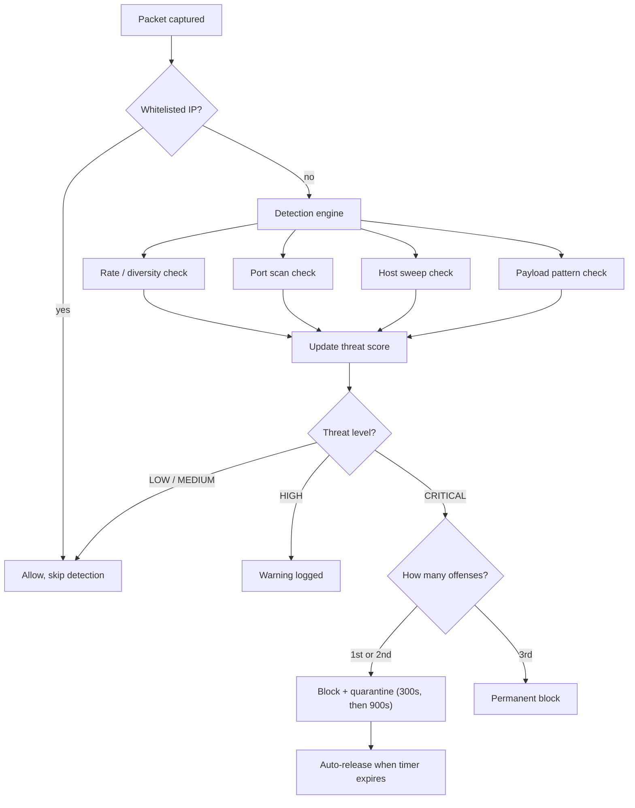

# FirewallX

FirewallX is a firewall and intrusion detection/prevention system I built for Windows in Python. I started it as a way to actually understand how firewalls, IDS, and IPS tools work under the hood, instead of just reading about them — so it watches live network traffic, scores behavior that looks suspicious, and automatically blocks and quarantines IPs that cross a threshold, using Windows' own firewall to enforce the block.

It went through a lot of iteration. It started as a plain packet sniffer, then grew into rule-based filtering, then behavior-based detection, and eventually an adaptive system that escalates its response the more times the same attacker shows up. "How this got built" further down walks through that progression.

## What it does

**Firewall** — blocks traffic by IP or port, driven by a config file, enforced through the real Windows Firewall (`netsh`).

**Detection (IDS)** — watches for a few different attack shapes:
- a source hitting a lot of distinct destination/port combinations quickly (rate/diversity anomaly)
- a source touching many different ports on one target (port scanning)
- a source touching many different hosts (network sweeping/recon)
- packet payloads matching known-bad patterns (e.g. SQL injection strings, `<script>` tags, shell command fragments)
- repeated retries against the exact same destination and port are deliberately *not* treated as an attack — more on why below

**Prevention (IPS)** — once an IP's threat score crosses a threshold, FirewallX blocks it automatically: a temporary quarantine on the first couple of offenses, escalating quarantine time on repeat offenses, and a permanent block after the third.

**Threat scoring** — every suspicious event adds points to a per-IP score, which decays back down over time if the IP goes quiet, and maps onto LOW / MEDIUM / HIGH / CRITICAL severity levels.

**Trust controls** — a whitelist (individual IPs or CIDR ranges) that bypasses detection entirely, plus a safeguard so the machine running FirewallX can never block itself.

## How it's put together

Traffic comes in through Scapy, gets checked against the whitelist, and if it's not trusted it goes through the detection engine (rate, port-scan, and host-sweep checks, plus payload inspection). Anything that trips a detector adds to that IP's threat score. Once the score crosses the CRITICAL threshold, the decision engine hands off to the enforcement layer, which adds a Windows Firewall rule and starts a quarantine timer. Everything gets logged along the way.

As a loop, it's roughly: **capture → detect → score → decide → act → recover → log.**



## Project layout

```
FirewallX/
│
├── src/
│   ├── firewall_engine.py    capture, detection, threat scoring, entry point
│   ├── enforce_firewall.py   Windows Firewall (netsh) enforcement
│   ├── logger.py             file logging
│   └── list_interfaces.py    helper — lists NIC names for settings.json
│
├── config/
│   ├── settings.example.json template — copy this to settings.json
│   ├── settings.json         your local config (gitignored, not committed)
│   └── rules.json            static block/whitelist rules
│
├── tests/                     unit tests (pytest) - exercise logic directly, no live capture needed
├── archive/                   early prototype scripts from the first few days, kept for history
├── logs/                      runtime log output (gitignored)
├── requirements.txt
├── requirements-dev.txt
└── README.md
```

## Configuration

`config/rules.json` holds static block/whitelist rules:

```json
{
  "block_ips": [],
  "block_ports": [443],
  "whitelist_ips": [
    "8.8.8.8",
    "1.1.1.1"
  ]
}
```

`config/settings.json` holds everything else — detection thresholds, quarantine timing, which network(s) count as your lab/monitored range, and which network interface to capture on. It's gitignored on purpose, since it normally contains your own local network details. Copy `config/settings.example.json` to get started.

## Getting it running

You'll need Windows, Python 3.10+, [Npcap](https://npcap.com/) (Scapy needs it to capture packets), and an Administrator terminal — adding firewall rules requires elevation.

```bash
# install dependencies
pip install -r requirements.txt

# create your local config from the template
copy config\settings.example.json config\settings.json

# find your network interface name
cd src
py list_interfaces.py

# put that interface name into config/settings.json under "network_interface",
# and set "lab_networks" to whichever subnet(s) you want to monitor

# run it (as Administrator)
py firewall_engine.py
```

```bash
# run the test suite (no Windows/Npcap needed - these test the logic directly)
pip install -r requirements-dev.txt
pytest tests/
```

## Reading the output

Every packet that gets processed prints a line like:
`[DIRECTION][ALLOWED|BLOCKED] PROTOCOL src_ip -> dst_ip PORT:n`

Detection alerts sit on top of that:

| Tag | What it means | Adds to score |
|---|---|---|
| `[RATE ALERT]` | one source hit a lot of distinct destination/port pairs quickly | +2 |
| `[SCAN ALERT]` | a lot of distinct ports seen from one source | +3 |
| `[HOST SWEEP ALERT]` | one source touched a lot of different destinations | +2 |
| `[PAYLOAD ALERT]` | packet contents matched a known-bad pattern | +5 |
| `[WARNING]` | score crossed the HIGH threshold | — |
| `[CRITICAL]` / `[QUARANTINE]` | score crossed CRITICAL — IP auto-blocked and quarantined | — |
| `[RELEASE]` | quarantine expired, block removed | — |
| `[PERMANENT BLOCK]` | third offense — blocked with no auto-release | — |

Everything printed to the console also gets appended to `logs/firewall.log`.

## Testing it against a real attacker

Reading the code convinced me the logic was sound, but I wanted to actually see it work against something hostile rather than just trust it. So I set up a small two-machine lab: this Windows box running FirewallX, and a Kali Linux VM on a private VirtualBox network acting as the attacker, and ran through a handful of real attack scenarios.

**Port scanning got picked up correctly** — running an `nmap` scan against the Windows host produced repeated `[RATE ALERT]` lines and pushed the threat score up. One thing that surprised me while checking this: because both machines were on the same local/lab subnet, the engine classified the traffic as `LAB` rather than plain `INBOUND`, and it turns out the dedicated port-scan detector only runs on inbound traffic from a non-private IP address. Same-subnet scans get caught by the rate/diversity detector instead — different code path, same result.

**Sustained scanning escalated all the way to a real block.** Once the score crossed CRITICAL, FirewallX added an actual Windows Firewall rule blocking the attacker's IP and started a quarantine timer — no manual step involved. I confirmed the rule was really there with `netsh advfirewall firewall show rule`. Triggering a second offense after that quarantine expired also showed off the adaptive escalation from the Day 19 work — the timeout jumped from 300 seconds to 900 automatically.

**The block was real, not just logged.** While the attacker was quarantined, I checked from both ends at once: `curl` from Kali to the Windows host timed out, and a connectivity test from Windows back to Kali failed too. And once the quarantine timer ran out, it released itself and traffic went back to normal — again, no manual step.

**A third offense triggered a permanent block** instead of another timed quarantine, exactly as the escalation policy describes — and unlike the first two, that rule has no expiry and stays until it's removed by hand.

**Whitelisting worked cleanly.** I added the attacker's IP to the whitelist, restarted the engine, and re-ran the scan — every single packet was skipped before it ever reached detection, with zero false alerts across the whole run. While checking this one I found a real (small) gap: the whitelist-skip message only went to the console via `print()`, never to `logs/firewall.log`. Not a detection bug — whitelisting itself worked exactly as intended — but relying on the log file alone would show zero evidence it ever happened. Fixed since: the whitelist-skip branch now writes to the log too, covered by a unit test that mocks `write_log` and asserts it's called with the right message.

A couple of practical things I ran into while setting this up, in case anyone else hits the same:

- Bridging the Kali VM onto my Wi-Fi adapter didn't work at all — no attacker traffic ever reached the capture. Consumer Wi-Fi routers generally only forward unicast frames for the one MAC address that's actually associated with them, and a bridged VM injects traffic under a different MAC, so it gets silently dropped. Switching the VM to a private VirtualBox host-only network instead fixed it completely.
- After switching, the VM and the host ended up on two different subnets because the host's adapter still had a manual IP left over from earlier testing — nothing could reach anything until I fixed that mismatch.
- Detection and scoring worked immediately, but the actual firewall rule silently failed to get created the first time. Turned out the terminal I was running the script from wasn't elevated, even though the editor it was opened from had admin rights — Windows doesn't inherit elevation that way, and `netsh` just fails quietly without it.
- Threat scores and offense counts only live in memory, so restarting the engine wipes them — worth knowing if a test seems to "reset" partway through.

## How this got built

The first stretch was just getting the fundamentals working: sniffing traffic with Scapy, filtering by IP and port, setting up logging, and putting together a rough first pass at detection.

The real turning point was adding threat severity levels and wiring detection up to actual enforcement — that's when it stopped being a monitor and became something that could act on its own. From there it was mostly about tuning: adding a decay mechanism so old threat scores fade out instead of accumulating forever, building a whitelist (including CIDR range support) so trusted traffic doesn't get flagged, and moving detection onto a sliding time window so it reacts to recent behavior instead of raw totals.

One of the more useful bugs I ran into: normal HTTPS traffic that got blocked would keep retrying, and each retry was getting counted as a fresh rate anomaly — so a single legitimate connection attempt could inflate a score into looking like an attack. Fixing that meant explicitly recognizing "repeated hits on the same destination and port" as retry noise rather than diverse attack behavior, which also cut down a lot of other false-positive noise at the same time.

After that came the actual response system — automatic Windows Firewall blocking, temporary quarantine, and auto-unblock once the timer runs out — which is when FirewallX became a real IPS instead of just an IDS with opinions. The last piece was adaptive escalation: repeat offenders get longer quarantines each time (300 seconds, then 900), and a third offense means a permanent block. Alongside that I tuned out a few remaining sources of false positives, like ignoring normal outbound browsing traffic and treating common response ports (DNS, HTTP, HTTPS) as safe by default.

## Where it stands

Working end-to-end and tested against a real attack, not just in theory: rule-based filtering, behavioral detection, threat scoring with decay, whitelisting (including CIDR), automated quarantine, adaptive escalation, and permanent blocking for repeat offenders.

## What's next

- Persisting attacker reputation across restarts instead of keeping it all in memory
- Making detection thresholds easier to tune without editing raw config
- Some kind of dashboard instead of reading a log file
- Deeper payload inspection
- Exporting logs somewhere a SIEM could ingest them
- Enforcement on platforms other than Windows
- Pulling in an actual threat intelligence feed rather than relying only on local behavior

## What I took away from this

Detection without tuning just creates false positives — real traffic is noisy, and static rules alone aren't enough to tell normal behavior from an attack. Looking at behavior over a time window helped a lot more than looking at raw totals. And prevention needs its own safeguards; automatically blocking things is powerful enough that it's worth being careful about how and when it fires. An adaptive response — one that gets stricter the more times it sees the same offender — ended up working a lot better than a single fixed rule ever could.

The longer-term idea is to keep pushing this toward something closer to a real lightweight endpoint firewall — a genuinely adaptive IPS agent rather than a learning project, with real-time monitoring instead of a log file you have to go read.
